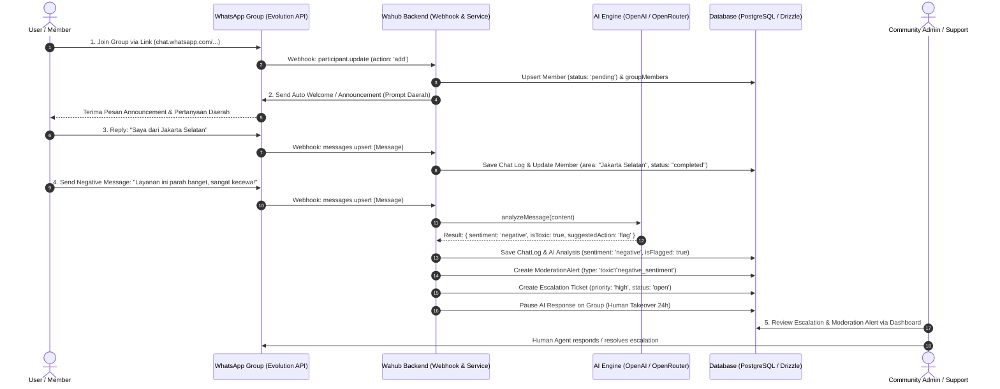

# Dokumen User Skenario: Onboarding, Announcement, Input Daerah, & Moderasi/Eskalasi Sentimen Negatif

Dokumen ini mendefinisikan skenario alur pengguna (*User Scenario & Flow*) dari tahap **Onboarding** hingga **Moderasi & Eskalasi** pada sistem Wahub Backend berdasarkan kode program dan arsitektur yang tersedia.

---

## 📌 Context & Scope
- **WhatsApp Group Link**: [https://chat.whatsapp.com/FFmDIPrq86ZFmlncOcFHYS](https://chat.whatsapp.com/FFmDIPrq86ZFmlncOcFHYS)
- **Scope Skenario**:
  1. User join grup via link WhatsApp.
  2. Sistem melakukan onboarding & mengirim pesan sambutan/pengumuman (*Announcement / Auto Welcome*).
  3. User membalas pesan dengan menyebutkan daerah asal (*Region/Area Input*).
  4. User membalas pesan berikutnya dengan **sentimen negatif** (keluhan / kritik pedas / kata toxic).
  5. Sistem mendeteksi sentimen negatif via AI & memicu **Moderasi Alerts** serta tiket **Eskalasi Support (Human Takeover)**.

---

## 🔄 User Journey Overview



---

## 📑 Rincian Langkah Skenario Pengguna (Detail Steps)

### Skenario 1: User Join WhatsApp Group
- **Aksi Pengguna**: User menekan link [https://chat.whatsapp.com/FFmDIPrq86ZFmlncOcFHYS](https://chat.whatsapp.com/FFmDIPrq86ZFmlncOcFHYS) dan bergabung ke WhatsApp Group.
- **Event Sistem (`webhook.service.ts`)**:
  - Event `participant.update` (action: `add`) dipicu oleh WhatsApp/Evolution API.
  - Handler `handleParticipantUpdate()` memproses nomor WhatsApp user (`whatsappNumber`).
  - Sistem secara otomatis mencatat data member baru di tabel `members` dengan `onboardingStatus = 'pending'`.
  - Menghubungkan ID Member dengan ID Group di tabel `group_members`.
  - Meng-update jumlah anggota grup (`memberCount`).

---

### Skenario 2: Auto Welcome / Announcement & Prompt Daerah
- **Aksi Sistem**:
  - Jika grup memiliki setting `autoWelcome = true`, sistem mengirimkan pengumuman otomatis ke grup.
  - **Isi Pesan Announcement**:
    > *"Selamat datang di komunitas! 👋🏼*
    > *Silakan baca peraturan grup dan perkenalkan diri Anda dengan membalas pesan ini:*
    > **Dari daerah manakah Anda berasal? (Contoh: Jakarta / Surabaya / Bandung)**"*
- **Event / Trigger (`services/evolution.service.ts` & `n8n`)**:
  - Sistem mengirim pesan via `EvolutionService.sendText()`.
  - Jika diintegrasikan dengan n8n (`N8N_WEBHOOK_URL`), event `participant.joined` dikirim ke n8n workflow untuk memicu alur percakapan onboarding.

---

### Skenario 3: User Membalas Daerah Asal (Onboarding Data Capture)
- **Aksi Pengguna**: User membalas pesan di grup:
  > *"Halo semua, saya dari Jakarta Selatan."*
- **Event Sistem (`webhook.service.ts`)**:
  - Event `messages.upsert` diterima oleh backend.
  - Pesan disimpan di tabel `chat_logs` (`direction = 'inbound'`).
  - AI Engine / Parser mengenali entitas lokasi/daerah.
  - Sistem memperbarui tabel `members`:
    - `area` = `"Jakarta Selatan"`
    - `onboardingStatus` = `"completed"`
  - Bot memberikan konfirmasi singkat:
    > *"Terima kasih @User! Daerah Anda (Jakarta Selatan) telah terdaftar. Selamat berdiskusi!"*

---

### Skenario 4: User Membalas dengan Sentimen Negatif / Keluhan
- **Aksi Pengguna**: User mengirimkan pesan mengekspresikan kekecewaan / sentimen negatif keras di grup:
  > *"Layanan komunitas ini parah banget, respon admin lelet dan mengecewakan! Tidak recommended sama sekali!"*
- **Event Sistem & Analisis AI (`services/ai.service.ts`)**:
  - Event `messages.upsert` diterima oleh backend dan disimpan ke `chat_logs`.
  - Backend memanggil `AiService.analyzeMessage()` (OpenAI/OpenRouter GPT model atau fallback heuristic analysis).
  - **Hasil Analisis AI**:
    ```json
    {
      "isSpam": false,
      "isToxic": true,
      "sentiment": "negative",
      "topic": "Customer Service / Complaint",
      "suggestedAction": "flag",
      "reason": "Mengandung keluhan keras dan sentimen sangat negatif terhadap layanan",
      "confidence": 0.95
    }
    ```
  - Backend menyimpan log analisis di tabel `ai_analyses` dan menandai `chat_logs`: `sentiment = 'negative'`, `isFlagged = true`.

---

### Skenario 5: Trigger Moderasi & Eskalasi (Human Takeover)
- **1. Moderasi Automatic Alert (`modules/moderation/moderation.service.ts`)**:
  - Karena pesan teridentifikasi `isToxic` atau `isFlagged` dan `group.autoModeration = true`, sistem membuat alert di tabel `moderation_alerts`:
    - `alertType`: `'toxic'` / `'negative_sentiment'`
    - `severity`: `'high'`
    - `status`: `'pending'`
    - `description`: `'Flagged by AI: Sentimen negatif / keluhan pengguna'`

- **2. Tiket Eskalasi Support (`modules/escalations/escalations.service.ts`)**:
  - Sistem membuat tiket eskalasi baru di tabel `escalations`:
    - `title`: `'Keluhan Sentimen Negatif Member: [Nomor WhatsApp]'`
    - `description`: `'Member mengirim pesan bermuatan sentimen negatif: "Layanan komunitas ini parah banget..."'`
    - `priority`: `'high'` / `'urgent'`
    - `status`: `'open'`

- **3. Human Takeover (Jeda AI Otimatis)**:
  - Untuk mencegah bot AI menjawab secara otomatis dan membuat user semakin kesal, sistem memperbarui `groups.aiPausedUntil = 24 jam ke depan`.
  - Bot FAQ AI dihentikan sementara pada grup tersebut sehingga Admin Manusia (*Support / Community Manager*) dapat mengambil alih percakapan (*Human Agent Takeover*).

- **4. Penanganan Admin melalui Dashboard (`admin / support`)**:
  - Admin menerima notifikasi pada dashboard Wahub.
  - Admin melakukan assign tiket eskalasi (`assignTo`), memberikan respon balasan langsung di WhatsApp, serta menentukan aksi moderasi pada alert (`approved` / `warning` / `executed`).

---

## 🗄️ Tabel Database Terlibat

| Nama Tabel | Peran & Perubahan Data dalam Skenario |
| :--- | :--- |
| [`members`](file:///g:/wahub/wahub-backend/drizzle/schema.ts#L70-L88) | Menyimpan data user, `whatsappNumber`, `area` (misal: "Jakarta Selatan"), dan `onboardingStatus` (`pending` -> `completed`). |
| [`groups`](file:///g:/wahub/wahub-backend/drizzle/schema.ts#L103-L124) | Menyimpan konfigurasi grup, `autoWelcome`, `autoModeration`, `memberCount`, dan `aiPausedUntil` saat terjadi eskalasi. |
| [`group_members`](file:///g:/wahub/wahub-backend/drizzle/schema.ts#L126-L145) | Relasi keanggotaan antara member dan grup. |
| [`chat_logs`](file:///g:/wahub/wahub-backend/drizzle/schema.ts#L147-L164) | Menyimpan seluruh riwayat pesan, `sentiment` (`negative`), `topic`, dan `isFlagged`. |
| [`ai_analyses`](file:///g:/wahub/wahub-backend/drizzle/schema.ts#L166-L175) | Record detail hasil ekstraksi AI (score confidence, sentiment, toxicity, reason). |
| [`moderation_alerts`](file:///g:/wahub/wahub-backend/drizzle/schema.ts#L177-L190) | Warning / alert moderasi yang perlu di-review oleh admin. |
| [`escalations`](file:///g:/wahub/wahub-backend/drizzle/schema.ts#L204-L217) | Tiket eskalasi penanganan keluhan member ber-priority tinggi untuk Admin Support. |

---

## 📌 Ringkasan Skenario

| Langkah | Aksi User / System | Status Onboarding | Output / Status Backend |
| :--- | :--- | :--- | :--- |
| **Step 1** | User klik link & join WA Group | `pending` | Record `members` & `group_members` dibuat |
| **Step 2** | System kirim Auto-Welcome & Announcement | `pending` | Pesan dikirim via Evolution API / n8n |
| **Step 3** | User jawab nama daerah (e.g. Jakarta Selatan) | `completed` | `members.area` terisi & `onboardingStatus` = `completed` |
| **Step 4** | User membalas dengan kata/sentimen negatif | `completed` | AI mendeteksi sentimen negatif, `chat_logs.isFlagged` = `true` |
| **Step 5** | Sistem pemicu Moderasi & Eskalasi | `completed` | Alert `moderation_alerts` & tiket `escalations` dibuat, AI paused (Human Takeover) |
